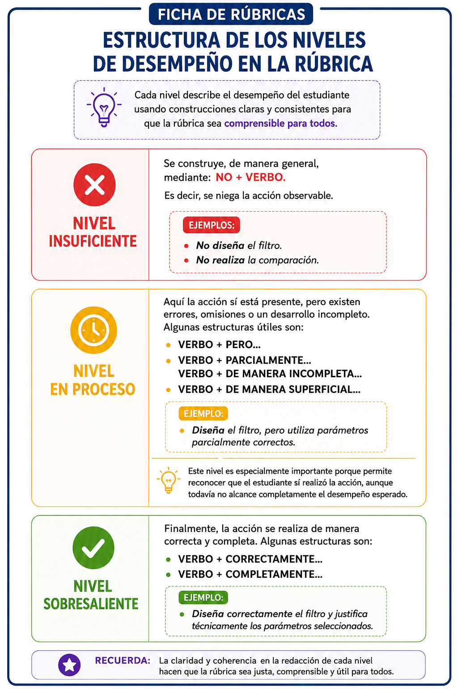
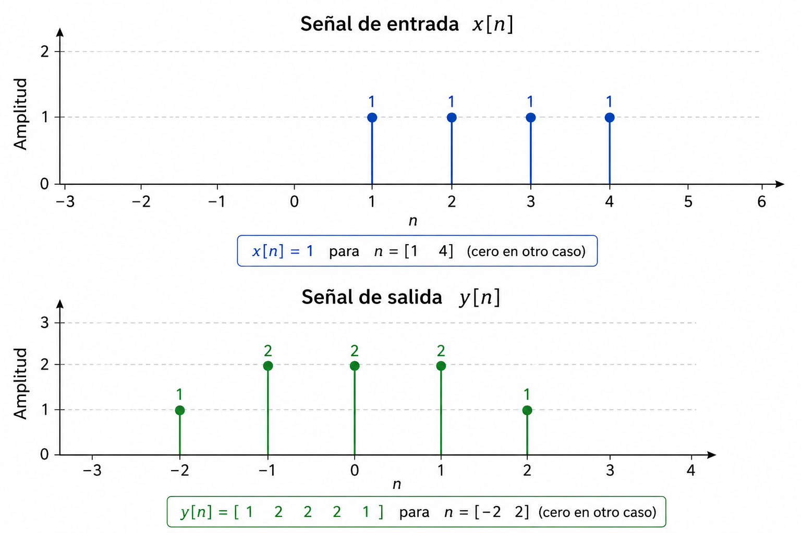

# 🧩 Reto 1. Descubriendo qué ocurre dentro de una caja negra

**Análisis de Señales**

---

## ⏱️ Duración

**1 hora**

Tiempo sugerido: **25 minutos por desafío** y **10 minutos para revisión y entrega**.

## 👥 Modalidad

**Trabajo por parejas.**

Cada pareja deberá entregar un **único archivo PDF generado a partir del notebook (.ipynb) desarrollado**, que incluya, para cada desafío:

- La **solución matemática (respuesta)**.
- La **explicación conceptual y matemática** del procedimiento utilizado para deducirla.
- El **código en Python** utilizado para verificar la solución.
- La **evidencia gráfica del resultado obtenido en Python**.
  
> 📌 **Importante:** Python se utiliza como herramienta de **verificación**. La solución debe deducirse primero a partir del análisis conceptual y matemático de las señales.
---

## Contexto

En un sistema de telecomunicaciones no siempre conocemos las operaciones que se realizan internamente sobre una señal. En algunas situaciones solo disponemos de la **señal de entrada** y la **señal de salida**, y a partir de ellas debemos inferir qué ocurrió dentro del sistema.

En este reto analizarán diferentes **cajas negras**. En cada caso conocerán su entrada y su salida, pero no la operación realizada internamente.

Su misión será **descubrir qué ocurrió dentro de cada caja negra y verificar su hipótesis utilizando Python.**

---

# 🧩 Desafío 1. ¿Qué transformación sufrió la señal?

Una señal discreta $x[n]$ ingresa a una **caja negra** que realiza una transformación desconocida de la variable independiente. A la salida se obtiene la señal $y[n]$.

  

A partir de las señales de entrada y salida:

### ¿Qué transformación de la variable independiente ocurrió dentro de la caja negra?

Su respuesta debe incluir:

- La **expresión matemática** que relaciona $y[n]$ con $x[n]$.
- Una explicación breve del **procedimiento utilizado para identificar la transformación**.
- Una **verificación en Python** que demuestre que la transformación propuesta reproduce correctamente la señal de salida observada.

> 💡 **Recuerden:** el objetivo no es encontrar la respuesta probando transformaciones en Python.  
> **Primero formulen una hipótesis y después utilicen Python para verificarla.**

## 📋 Rúbrica de evaluación

### 🎯 Criterio 1. Transformación de la variable independiente

**Implementa y evalúa técnicas de manipulación temporal utilizando Python, para el análisis y la solución de problemas de transformación de la variable independiente.**

| Acción observable | Insuficiente **(0)** | En proceso **(250)** | Sobresaliente **(500)** | Peso |
|---|---|---|---|---:|
| **Explica conceptual y matemáticamente el procedimiento que permite deducir la transformación de la variable independiente.** | **No explica** el razonamiento conceptual y matemático o el razonamiento presentado es incorrecto. | **Explica parcialmente** el razonamiento conceptual y matemático, pero **no deduce correctamente la transformación de la variable independiente**. | **Explica correctamente** el razonamiento conceptual y matemático y **deduce correctamente la transformación de la variable independiente**. | **65 %** |
| **Implementa en Python la transformación de la variable independiente y verifica el resultado.** | **No implementa** el código en Python o el código presentado es incorrecto. | **Implementa parcialmente** el código en Python, pero la solución está incompleta. | **Implementa correcta y completamente** el código en Python y **verifica correctamente** la transformación obtenida. | **35 %** |

### Cálculo de la nota

La nota del desafío corresponde a la suma ponderada de las notas obtenidas en cada acción observable:

**Nota Desafío 1 = 0.65 × (Explicación conceptual y matemática) + 0.35 × (Implementación en Python)**
---------

# 🧩 Desafío 2. ¿Qué sistema se encuentra dentro de la caja negra?

Una señal discreta $x[n]$ ingresa a un **sistema LTI desconocido**. A la salida se obtiene la señal $y[n]$.

Se sabe que la relación entre la entrada, la respuesta al impulso del sistema y la salida está dada por:

$$
y[n]=x[n]*h[n]
$$

  

A partir de las señales de entrada y salida:

### ¿Cuál es la respuesta al impulso $h[n]$ del sistema?

Su respuesta debe incluir:

- La **expresión matemática** de $h[n]$ y su correspondiente soporte temporal.
- Una explicación breve del **procedimiento utilizado para identificarla**.
- Una **verificación en Python**, utilizando convolución discreta, que demuestre que la respuesta al impulso propuesta reproduce exactamente la señal de salida observada.

> 💡 **Recuerden:** Python se utiliza para verificar la solución propuesta.  
> Primero analicen las señales $x[n]$ y $y[n]$ e identifiquen una posible $h[n]$; después comprueben su respuesta mediante convolución.

---

## 📋 Rúbrica de evaluación

### 🎯 Criterio 2. Convolución de señales discretas

**Implementa y evalúa técnicas de convolución de señales discretas utilizando Python, para el análisis y la solución de problemas de convolución de señales discretas.**

| Acción observable | Insuficiente **(0)** | En proceso **(250)** | Sobresaliente **(500)** | Peso |
|---|---|---|---|---:|
| **Explica conceptual y matemáticamente el procedimiento que permite deducir la respuesta al impulso $h[n]$ mediante convolución de señales discretas.** | **No explica** el razonamiento conceptual y matemático o el razonamiento presentado es incorrecto. | **Explica parcialmente** el razonamiento conceptual y matemático, pero **no deduce correctamente la respuesta al impulso $h[n]$**. | **Explica correctamente** el razonamiento conceptual y matemático y **deduce correctamente la respuesta al impulso $h[n]$**. | **65 %** |
| **Implementa en Python la convolución de señales discretas y verifica el resultado.** | **No implementa** el código en Python o el código presentado es incorrecto. | **Implementa parcialmente** el código en Python, pero la solución está incompleta. | **Implementa correcta y completamente** el código en Python y **verifica correctamente** que la respuesta al impulso obtenida reproduce la señal de salida. | **35 %** |

### Cálculo de la nota

La nota del desafío corresponde a la suma ponderada de las notas obtenidas en cada acción observable:

**Nota Desafío 2 = 0.65 × (Explicación conceptual y matemática) + 0.35 × (Implementación en Python)**

---
**La nota final del Reto es el promedio de los dos desafios.**
